# Dossier de Restitution — DC

> **Division Commerciale** (DC) — incluant **DRM** (Direction Revenue Management) et **DVR** (Direction Ventes & Réseau)
> **Contrat** : n° xx/DAG/2026 — *Diagnostic, intégration, automatisation et MDM*
> **Phase 1** : Diagnostic & analyse des points de friction
> **Version** : 1.1 — *post-restitution 24/05/2026, à valider*
> **Date** : 24 mai 2026
> **Prestataire** : EURL Alpha Aero Systems — M. KARKI (chef de projet)
> **Référents client mobilisés** : BELDJERDI Zakaria · LAIDANI Zakaria · HASSISSENE Chemseddine · SAAD Nassima · BOUCHIK Mounir · SAFAR ZITOUN Naim · AKKACHA Mohamed Amine

---

## Sommaire

1. Synthèse exécutive
2. Cadre & méthodologie
3. Périmètre couvert pour la DC
4. Cartographie du SI DC
5. Restitution consolidée des questionnaires
6. Processus DC — cartographie et diagnostic
7. Points de friction identifiés
8. Recommandations
9. Apports de l'ETL et du MDM à terme
10. Annexes

---

## 1. Synthèse exécutive

La **Division Commerciale (DC)** porte l'intégralité de la chaîne **commerciale, tarifaire, distribution et recettes** d'Air Algérie. Contrairement à la DMRA qui repose sur un système mono-applicatif (AMOS), la DC opère un SI **fortement éclaté** entre des plateformes externes éditeurs (Amadeus, ATPCO, OAG, IATA, ACCELYA, VocalCom), des outils tiers de paiement / monitoring, et un système de doléances internalisé (E-doléance).

**Chiffres clés DC** :

| Indicateur | Valeur |
|---|---:|
| Sous-directions couvertes | **3** — DC (pilote), DRM, DVR |
| Systèmes sous responsabilité DC | **10** — ATPCO, OAG, **ALTEA (Suite Altéa Amadeus)**, **ACCELYA (Rapid Passagers — Revenue Accounting)**, SITEWEB, BAC, ACCELYA-DIST (Axelia), BSPLINK, VOCALCOM, EDOLEANCE |
| Flux entrants/sortants identifiés | **14** (cartographie 2026-04, à enrichir post-restitution) |
| Questionnaires key-user | **8** (7 complétés, 1 à démarrer — E-Doléance V2) |
| Taux de complétion questionnaire | **100 %** (72/72 questions répondues sur 7 questionnaires) |
| Processus impliquant la DC | **8** (3 propres DC + 5 transverses) |
| Étapes de processus cartographiées | **82** |
| Key-users mobilisés | **8** |
| Entretiens collégiaux tenus | **3** — DRM 22/04/2026, DVR 29/04/2026, **restitution DC 24/05/2026** |

**Constats principaux** :

1. **SI commercial entièrement structuré autour de la Suite Altéa Amadeus** : Altéa est à la fois système central (PSS, Inventory, DCS, Ticketing, RMS) et canal — toutes les autres briques (BAC, ACCELYA RAPID, ACCELYA Distribution, BSP Link, VocalCom, E-doléance, Site WEB) viennent s'y greffer en entrée ou en sortie. *(Entretien DRM 22/04/2026 — confirmé restitution 24/05/2026)*
2. **Rapprochement Distribution ↔ Recettes : partiellement automatisé via RAPID, manuel uniquement sur Axelia** — correction restitution 24/05/2026 : le système **ACCELYA RAPID** (Revenue Accounting) capture automatiquement les ventes directes ET indirectes, effectue le rapprochement par numéro de billet et détecte les anomalies liées aux inputs utilisateurs. Le traitement manuel via Excel ne concerne que **l'audit ACCELYA Distribution (Axelia)** lié au booking (ADM / redressements). *(Restitution DC 24/05/2026 — nihad bounab + nassim nassim)*
3. **Le système BAC (Amadeus) est mal positionné dans la cartographie initiale** : il s'agit d'un dashboard / reporting opérationnel de la suite Altea — il **ne couvre pas la facturation intercompagnies**, qui relève de la **SD Recettes Commerciales** rattachée à la DRM. Le key user désigné sur ce système doit être **réaffecté**. *(Entretien DVR 29/04/2026)*
4. **Idoléance V2 introduit deux nouveaux services** : litige bagage (lié à World Tracer) et FFP (lié à ALMS). Les questionnaires et la cartographie doivent être actualisés en conséquence avant validation. *(Entretien DVR 29/04/2026)*
5. **Accès à Altea — dans le cadre de l'ETL Phase 2** : pas d'accès direct base attendu côté ETL Alpha. L'intégration cible se fait via **feeds quotidiens Amadeus** (PNR, ticket, payment, fournis par la DSI) et **APIs ciblées via Change Proposal Amadeus** (payant, sur cas d'usage à fort ROI uniquement). Précision : c'est l'ETL qui n'a pas d'accès direct, pas Air Algérie. *(Entretien DRM 22/04/2026 — précisé restitution 24/05/2026 par Leila Chenane)*
6. **Distribution & accréditations** : ~150 contrats Interline actifs, 2 CodeShare (dont Turkish Airlines), commission zéro avec frais de service + 3 contrats incentives exceptionnels en Algérie (à confirmer). *(Entretien DVR 29/04/2026)*
7. **Call center 24/7** : 104 opérateurs, outils Hermès / LTA / ARDE / OPS / ALMS, agents capables de réservations / modifications / ventes / remboursements directement dans Altea. *(Entretien DVR 29/04/2026)*
8. **Volume de PNR de l'ordre de plusieurs millions** avec durée de vie de quelques minutes à plusieurs semaines — paramètre dimensionnant pour l'architecture ETL cible. *(Entretien DRM 22/04/2026)*
9. **Process métiers DRM — Excel limité aux process financiers manuels** *(constat reformulé restitution 24/05/2026)* :
   - **NE sont PAS sur Excel** : programmation des vols (système dédié), suivi tarifaire et performances (**RMS Amadeus**), gestion des charges back / impayés (**plateforme dédiée externe** ≈ Merchant Connect pour Visa/Mastercard).
   - **Restent sur Excel** : rapprochement bancaire (multi-sources, plusieurs fichiers à consolider), réconciliation et détection des anomalies de paiement (investigations multi-systèmes ARD Web / Amadeus Payment Platform / ELAVON), élaboration des devis charter (cf. §7.8). *(Restitution 24/05/2026 — nassim nassim, nihad bounab)*

**Apports attendus de la Phase 2 pour la DC** :

- **Hub d'extraction Altea unifié** alimenté par feeds Amadeus quotidiens (PNR / Ticket / Payment) — Lot 6.
- **Automatisation du rapprochement** ventes Axelia/BSP ↔ recettes (suppression d'Excel) — Lot 7.
- **MDM Tarif & Distribution** avec ATPCO/OAG comme systèmes maîtres pour la tarification et le programme — Lot 12.
- **Refonte de la chaîne paiement / chargebacks** (intégration ELAVON / SATIM / CCP / Amadeus Payment Platform) — Lot 7.
- **Dashboard commercial unifié** (par canal, agence, tendance, prévision, part de marché) — Lot 8.

---

## 2. Cadre & méthodologie

### 2.1 Sources mobilisées pour le diagnostic DC

| # | Source | Volume DC |
|---|---|---|
| 1 | Manuel des Processus Air Algérie (DQSA, juin 2021) | 3 process DC documentés |
| 2 | Questionnaires structurés (8 systèmes) | 72 questions / 7 questionnaires complétés |
| 3 | Entretien collégial **DRM du 22 avril 2026** | 4 participants côté Air Algérie |
| 4 | Entretien collégial **DVR du 29 avril 2026** | 7 participants côté Air Algérie |
| 5 | Canevas Process Key-Users — **BELDJERDI Zakaria** (DRM, 19/05/2026) | 12 process complémentaires déclarés |
| 6 | **Réunion de restitution DC du 24 mai 2026** | Corrections du dossier, refonte du process DIVEX-02 |
| 7 | Cartographie SI Alpha (Django) | 8 process, 14 flux modélisés |

### 2.2 Participants aux entretiens

**Entretien DRM — 22 avril 2026** :

- Côté Air Algérie : équipe DRM (animateur **Leila Chenane**), **Benkerit** (responsable SI), **nassim nassim**, équipe DSI ADSI/LSS.
- Côté Alpha : M. Ali KARKI, M. Mohamedamine KARKI.

**Entretien DVR — 29 avril 2026** :

- Côté Air Algérie : **Mme Bouneb**, **Mme Saadal**, **M. AKKACHA Mohamed Amine** (DVR), **HASSISSENE Chemseddine** (BAC), **SAAD Nassima** (BSP Link / ACCELYA), **Mahanemi** (DRM), **Dekdouk** (modérateur), Sous-direction Coopération (SPA/CodeShare/Interline).
- Côté Alpha : M. Ali KARKI, M. Mohamedamine KARKI, M. Mohamed Amine.

**Réunion de restitution DC — 24 mai 2026** :

- Côté Air Algérie : **Leila Chenane** (DC), **nihad bounab** (Directrice DVR), **nassim nassim** (DRM), **Fiala** (DCS / Opérations Sol — World Tracer / Datawarehouse Feeds), **Manef Hadfi** (DVR), équipe DRM/DVR.
- Côté Alpha : M. Ali KARKI, M. Mohamedamine KARKI.
- **Objet** : revue du présent dossier section par section, corrections à chaud, validation des process et refonte détaillée du process **PROC-AA-DIVEX-02** (cf. §6.2.4).

### 2.3 Périmètre fonctionnel couvert

Les 8 questionnaires structurés couvrent les axes :

- **Tarification & contenu commercial** : ATPCO, OAG / INNOVATA.
- **Distribution agences & GDS** : ACCELYA Distribution (Axelia), BSP Link, BAC (Amadeus).
- **Vente directe** : Site WEB Air Algérie, Hermès Call Center (VocalCom).
- **Relation client & doléances** : E-Doléance.

### 2.4 Statut de la collecte

| Élément | Statut |
|---|:---:|
| Questionnaires complétés | ✅ 7/8 (100 % des questions répondues) |
| Questionnaire E-Doléance V2 | 🟠 À démarrer (nouveau périmètre litige bagage + FFP) |
| Validation key-users (7 systèmes) | ✅ Soumis par les key-users désignés |
| Validation hiérarchique DC / DRM / DVR | 🟠 En attente (workflow multi-structure activé) |
| Process DC modélisés | ✅ 8 process / 82 étapes |
| Canevas process complémentaire DRM | ✅ Reçu (BELDJERDI, 12 process additionnels) |
| Workflows graphiques générés | ✅ Mermaid disponibles pour chaque process |

---

## 3. Périmètre couvert pour la DC

### 3.1 Structure organisationnelle

| Code | Libellé | Rattachement |
|---|---|---|
| **DC** | Division Commerciale | Direction Générale (DG) — pilote |
| **DRM** | Direction du Revenue Management | DC |
| **DVR** | Direction des Ventes et Réseau | DC |

> **Sous-directions citées en entretien (non encore modélisées comme structures distinctes)** : SDGDD/SDGT (audits Booking BIDT), SDRC (audits tarifaires + recettes commerciales), SD Coopération (SPA / CodeShare / Interline). À cartographier en Phase 2 si granularité requise.

### 3.2 Périmètre fonctionnel DC

*(Périmètre confirmé et complété lors de la restitution DC du 24/05/2026 — ajout des agences ATO/CTO, distinction explicite agences externes vs directes Air Algérie, ajout de l'inventaire)*

La DC assure :

- La **tarification** : filling tarifaire global via **ATPCO** + filling spécifique site web via **Farexpert** (⚠️ deux outils distincts, cf. §4.3.8). Familles, classes, cabines.
- La **diffusion du programme** de vol vers les GDS (OAG / INNOVATA) et la **gestion de l'inventaire** (Altea Inventory).
- La **distribution agences** — deux canaux distincts :
  - **Agences externes** via BSP Link (IATA) et GDS — distribution indirecte.
  - **Agences propres Air Algérie** (ATO/CTO) via le PSS Amadeus — distribution directe.
- La **vente directe** via le **Site Web** Air Algérie (IBE) et le **Call Center** 24/7 (104 opérateurs sur VocalCom Hermès).
- Le **revenue accounting** via **ACCELYA RAPID** : capture des ventes directes ET indirectes, rapprochements automatiques par n° de billet, détection des anomalies (correction restitution 24/05/2026).
- Le **contrôle distribution** via **ACCELYA Distribution (Axelia)** : audits ADM liés au booking (le tarifaire relève de la SDRC).
- Le **reporting opérationnel commercial** via BAC (Amadeus).
- La **gestion des doléances passagers** via E-Doléance (extension V2 en cours : litige bagage + FFP).
- Le **revenue management** (RMS Amadeus, suivi performance par canal / agence / route).
- La **gestion des contrats** Interline (~150) et CodeShare (2 — dont Turkish Airlines).

---

## 4. Cartographie du SI DC

### 4.1 Systèmes sous responsabilité DC

| Code | Nom | Éditeur | Catégorie | Criticité | Périmètre |
|---|---|---|---|:---:|---|
| **ALTEA** | Suite Altéa Amadeus | Amadeus | Métier — PSS central | 🔴 HAUTE | PSS + Inventory + DCS + Ticketing + RMS — système central de la DC *(ajouté 24/05/2026)* |
| **ACCELYA** | RAPID Passagers (Revenue Accounting) | ACCELYA | Métier — Recettes | 🔴 HAUTE | Revenue Accounting, capture ventes directes+indirectes, rapprochements automatiques *(formalisé 24/05/2026)* |
| **ATPCO** | ATPCO | ATPCO | Métier — Tarification | 🔴 HAUTE | Filling tarifaire global (toutes destinations) |
| **OAG** | OAG / INNOVATA | OAG | Métier — Programme | 🔴 HAUTE | Diffusion programme de vol |
| **SITEWEB** | Site WEB Air Algérie | KYO (intégrateur) | Métier — Vente directe | 🔴 HAUTE | IBE web + mobile |
| **ACCELYA-DIST** | ACCELYA Distribution (Axelia) | ACCELYA | Métier — Distribution | 🔴 HAUTE | Audits ADM liés au booking (le tarifaire = SDRC) |
| **BAC** | BAC (Business Analytics Center) | Amadeus | Reporting | 🟠 MOYENNE | Dashboards inventaire / bookings (lecture seule) |
| **BSPLINK** | BSP Link | IATA | Métier — Distribution | 🔴 HAUTE | Billing & Settlement Plan agences |
| **VOCALCOM** | Hermès Call Center | VocalCom | Métier — Call center | 🟠 MOYENNE | Téléphonie + outil agents |
| **EDOLEANCE** | E-Doléance | DSI (In-house) | Métier — Service client | 🟠 MOYENNE | Réclamations passagers |

> **Note restitution 24/05/2026** — La **Suite Altéa** et **ACCELYA RAPID** étaient présentes en base mais absentes du dossier de restitution v1.0. Elles sont désormais explicitement listées. Aucune création de système requise.

> **Précision DRM 22/04/2026** — La codification couleur de criticité a été reconfirmée : **orange = criticité moyenne**, **rouge = très critique** (ex : systèmes cartes, paiement).

### 4.2 Flux entrants / sortants confirmés

| # | Flux | Sens | Fréq. | Auto | Critique |
|---|---|---|---|:---:|:---:|
| F-15 | Tarifs ATPCO | ATPCO → ALTEA | Quotidien | ✅ | 🔴 |
| F-2 | Programme de vol OAG | AIMS → OAG | Quotidien | ✅ | — |
| F-58 | Programme OAG retour | OAG → ALTEA | Quotidien | ✅ | — |
| F-18 | Disponibilités IBE | ALTEA → SITEWEB | Temps réel | ✅ | 🔴 |
| F-19 | Réservations Web | SITEWEB → ALTEA | Temps réel | ✅ | 🔴 |
| F-22 | Ventes Agences | ALTEA → BSPLINK | Quotidien | ✅ | 🔴 |
| F-12 | Compensation BSP | BSPLINK → ACCELYA | Périodique | ✅ | 🔴 |
| F-34 | Ventes BSP France | BSPLINK → DATAWINGS | Périodique | ✅ | — |
| F-23 | Données Distribution | ALTEA → ACCELYA-DIST | Quotidien | ✅ | — |
| F-24 | Contrôle Distribution | ACCELYA-DIST → ACCELYA | Périodique | ✅ | — |
| F-44 | Bookings BAC | ALTEA → BAC | Quotidien | ✅ | — |
| F-20 | Données PNR Call Center | ALTEA → VOCALCOM | Temps réel | ✅ | 🔴 |
| F-21 | Modifications PNR | VOCALCOM → ALTEA | Temps réel | ✅ | 🔴 |
| F-49 | Réclamations Passagers | ALTEA → EDOLEANCE | Périodique | ✅ | — |

### 4.3 Précisions et corrections issues des entretiens

#### 4.3.1 Idoléance V2 — extension de périmètre (DVR 29/04/2026)

La **version 2 d'Idoléance** introduit **deux nouveaux services** qui n'étaient pas dans le périmètre initial du questionnaire :

- **Litige bagage** lié à **World Tracer** : création WorldTracer / saisie par mail si indisponible / recherche automatique / suivi accessible passager via n° de dossier.
- **FFP (Frequent Flyer Program)** lié à **ALMS** (Altea Loyalty Management System).

> **Conséquence** : le questionnaire E-Doléance doit être **actualisé** ; les flux entrants depuis WorldTracer et ALMS doivent être ajoutés à la cartographie (à modéliser en V1.1 du dossier).

#### 4.3.2 BAC (Amadeus) — clarification de portée (DVR 29/04/2026)

Plusieurs intervenants ont confirmé que **le BAC est un dashboard / reporting** de la suite Altea, **en lecture seule**, centré sur :

- Inventaire et availability.
- Bookings et indicateurs opérationnels.
- KPI de performance commerciale.

> **Point critique** : le BAC **NE GÈRE PAS** la facturation intercompagnies ni les recettes. Ces aspects relèvent de la **SD Recettes Commerciales** rattachée à la DRM. Le key user actuellement désigné sur le questionnaire BAC doit être **réaffecté** à une personne pertinente sur le périmètre reporting opérationnel (et non financier).

#### 4.3.3 Altea — accès et stratégie cible (DRM 22/04/2026)

- **Accès direct base Altea** : peu probable. À privilégier :
  - **Feeds quotidiens Amadeus** (PNR / Ticket / Payment) — voie pragmatique et riche.
  - **APIs via portail développeur Amadeus** — accès au cas par cas via **Change Proposal** (payant).
- **Volume PNR** : ordre du **million**, durée de vie variable (minutes → semaines).
- **PNR groupes** : créés via Amadeus, même logique fonctionnelle que les PNR individuels.
- **Canaux de vente directs** : Altea Réservation + Booking Engine web (ARD Web + DCS).
- **Granularité Altea cartographique** : la suite est composée de **sous-modules** (DCS, RMS, Inventory, Reservation, Ticketing, Data Feeds) — le projet doit affecter les flux aux modules techniques appropriés (en cours dans la cartographie locale).

#### 4.3.4 Distribution — clarifications (DVR 29/04/2026)

- La plateforme fournie à la **SDGDD/SDGT** vise les **audits Booking (BIDT)** ; les **audits tarifaires** relèvent de la **SDRC**.
- **Axelia (ACCELYA Distribution)** souffre de **manques fonctionnels** par rapport à l'ancien outil **Zeus** (absence de filtres personnalisés, différences d'exports). Les utilisateurs demandent : analyses détaillées par canal / agence / tendance / prévision / part de marché, et un lien avec **RAPID**.
- Les fichiers `airlinebilling.zip` sont téléchargés par les **unités locales** depuis BSP Link ; l'unité support ne les consulte pas régulièrement.
- Le suivi des incidents de paiement est géré via BSP pour la plupart des marchés ; en **Algérie**, le suivi reste **manuel**.

#### 4.3.5 Accréditations & modèle commercial (DVR 29/04/2026)

- **Accréditation IATA en Algérie** : passage par le **bureau AIP-DVR**, choix des compagnies, puis dépôt en direction régionale pour opérer localement.
- **Modèle commercial** : commission zéro avec **frais de service**, et **3 contrats incentives** exceptionnels accordés aux meilleures agences en Algérie (à confirmer par échantillon anonymisé — action SAAD Nassima / Mahanemi).

#### 4.3.6 Interline & CodeShare (DVR 29/04/2026)

- Trois types de contrats : **SPA, CodeShare, Interline**.
- **~150 contrats Interline** actifs.
- **2 CodeShare** dont **Turkish Airlines** (à confirmer la liste exhaustive).
- **Facturation intercompagnies** : gérée par la **SD Recettes Commerciales** rattachée à la DRM (≠ BAC).

#### 4.3.7 Call center (DVR 29/04/2026)

- **24/7**, **104 opérateurs**, pics saisonniers et promotionnels suivis temps réel.
- Outils utilisés : **Hermès** (téléphonie), **LTA / ARDE** (PNR / réservation), **OPS**, **ALMS**.
- Les agents peuvent **réaliser réservations, modifications, ventes et remboursements** directement dans Altea.
- **Volumétrie restitution 24/05/2026** : ~**9 000 appels/jour**, le temps d'attente dépend du nombre d'agents en production. Recommandation : optimiser la prédiction des pics et redimensionner les plannings.
- **Nouveau service activé (mai 2026)** : **Gestion du client fidèle** — dès l'appel, orientation directe vers le service Fidélisation pour les clients du programme. *(nihad bounab, 24/05/2026)*

#### 4.3.8 Corrections issues de la réunion de restitution DC du 24/05/2026

**Corrections majeures portées au dossier v1.0 lors de la revue collective** :

1. **RAPID (ACCELYA Revenue Accounting)** — système central absent du dossier v1.0, ajouté dans la liste des systèmes (§4.1) et reformulé dans le constat n°2 (§1). Capture toutes les ventes (directes et indirectes), effectue rapprochements et détection d'anomalies liées aux inputs utilisateurs. Le traitement manuel Excel ne concerne que l'audit Axelia ADM (booking).

2. **Process DRM sur Excel** — reformulé : seuls le **rapprochement bancaire**, la **réconciliation des anomalies de paiement** et l'**élaboration des devis charter** restent sur Excel. Programmation des vols, suivi tarifaire (RMS) et charges back (plateforme dédiée ≈ Merchant Connect) sont déjà automatisés.

3. **ATPCO vs Farexpert** — ce sont **deux outils distincts** :
   - **ATPCO** : filling tarifaire global (l'ensemble des destinations / GDS).
   - **Farexpert** : filling tarifaire spécifique à l'expérience **site web** (IBE).
   *Aujourd'hui Farexpert n'est pas modélisé dans la cartographie (cf. §4.4 hypothèses BELDJERDI).*

4. **Comptabilité IBE (DRM-06)** — le traitement des écarts de rapprochement est réalisé par l'**équipe commerciale (DRM, sous-direction Financier e-commerce / Responsable Payment)**, et **non par la DFC**. La DFC reçoit en fin de cycle un dossier déjà aligné (balances mensuelles et trimestrielles).

5. **Chargebacks (DRM-08)** — gérés via une **plateforme dédiée externe** (~Merchant Connect, service financier hébergé fournisseur) pour les impayés Visa/Mastercard. **Non intégrée** à la cartographie (demande explicite Air Algérie).

6. **ARDweb** — **solution interne développée par la DSI** Air Algérie (et non un module Amadeus). Remplace les fichiers Excel/Google Drive éparpillés par des **tables et référentiels centralisés avec accès partagé** et traçabilité des modifications.

7. **World Tracer (PROC-WT-001)** — ce système **relève de la division Exploitation**, pas de la DC. La DC n'intervient que sur le **traitement des données passager** lorsque l'irrégularité a un impact commercial. Migration en cours vers accès HTTPS ; jusqu'à oct 2026 disponible via Altea/DCS ; certaines escales utilisent encore le TLX faute de déploiement WorldTracer. *(Fiala, 24/05/2026)*

8. **PROC-AA-DOS-05 Datawarehouse Feeds** — confirmation des deux problématiques bloquantes : interventions manuelles pour clôture des vols (dépendance TNAO, non automatisable côté escales tierces type Moscou sous embargo) et messages LDM avec transmission erronée ou absente (impact AIMS / AMOS). *(Fiala, 24/05/2026)*

9. **PROC-AA-DIVEX-02 (vols charter)** — **refonte des étapes après la 6**. Cf. §6.2.4 pour le détail.

### 4.4 Hypothèses cartographie — issues du canevas BELDJERDI (à confirmer)

Le canevas Process Key-Users transmis par **BELDJERDI Zakaria** (DRM, 19/05/2026) liste **12 process complémentaires** dont la mise en œuvre fait intervenir une **quinzaine de systèmes non encore modélisés** dans la cartographie locale. Il s'agit d'**hypothèses à confirmer** avant intégration formelle :

| Système déclaré | Hypothèse de catégorie | Fonction supposée | À confirmer avec |
|---|---|---|---|
| **Site Manager** | Métier — CMS web | Gestion contenu et tarification IBE | BELDJERDI / KYO |
| **CMS** | Métier — CMS web | Gestion contenu éditorial site/mobile | BELDJERDI |
| **PCM** | Métier — Catalogue produits | Pricing / Catalogue Management | BELDJERDI |
| **Farexpert** | Métier — Tarification | Outil de filling tarifaire | BELDJERDI |
| **AAM** | Métier — Mobile | Air Algérie Mobile (application) | BELDJERDI |
| **Amadeus Payment Platform** | Métier — Paiement | Plateforme de paiement Amadeus (intégration ARD Web) | DRM + Amadeus |
| **ELAVON** | Métier — Paiement bancaire | Acquéreur monétique | BELDJERDI + DFC |
| **SATIM** | Métier — Paiement local | Compensation interbancaire algérienne | BELDJERDI + DFC |
| **CCP** | Métier — Paiement local | Centre Chèques Postaux | BELDJERDI + DFC |
| **DataHub** | Plateforme — Intégration | Bus de données interne (?) | BELDJERDI + DSI |
| **Google Analytics** | Outil tiers — Analytics | Mesure audience web | BELDJERDI |
| **Firebase** | Outil tiers — Analytics mobile | Mesure audience mobile | BELDJERDI |
| **Google Play Console** | Outil tiers — Distribution | Suivi app Android | BELDJERDI |
| **App Store Connect** | Outil tiers — Distribution | Suivi app iOS | BELDJERDI |
| **Freshping** | Outil tiers — Monitoring | Monitoring disponibilité plateformes | BELDJERDI |
| **RPTG monitoring** | Outil tiers — Monitoring | Monitoring (à préciser) | BELDJERDI |

> Ces systèmes seront **intégrés à la cartographie en V1.1** du présent dossier, après validation par les key-users DRM et arbitrage sur le niveau de granularité souhaité (chaque outil tiers Google/Firebase doit-il être systématiquement modélisé, ou faut-il une catégorie "outillage analytics tiers" agrégée ?).

---

## 5. Restitution consolidée des questionnaires

### 5.1 ATPCO — LAIDANI Zakaria (DRM)

**Synthèse** :

- ATPCO est le **système de filling tarifaire** : Air Algérie y publie ses tarifs, qui sont ensuite consommés par Altea.
- Le flux **F-15 ATPCO → ALTEA** est automatisé et critique.
- Les **outputs** : tarifs publiés disponibles côté GDS et IBE.

### 5.2 OAG / INNOVATA — SAFAR ZITOUN Naim (DRM)

**Synthèse** :

- OAG diffuse le **programme de vol** d'Air Algérie aux acteurs de l'industrie.
- Flux entrant **F-2 AIMS → OAG** (publication programme) et flux retour **F-58 OAG → ALTEA** (en cas d'ajustements industrie).

### 5.3 Site WEB Air Algérie (IBE) — BELDJERDI Zakaria (DRM)

**Synthèse** :

- L'IBE est la **vitrine digitale** de la vente directe.
- Flux **F-18 ALTEA → SITEWEB** (disponibilités) et **F-19 SITEWEB → ALTEA** (réservations) — tous deux temps réel et critiques.
- Le site est intégré à un **CMS** et à un **Site Manager** (intégrateur KYO) — voir hypothèses §4.4.
- **Process complémentaires déclarés par BELDJERDI** (canevas 19/05/2026) : 12 process couvrant affichage destinations, filling tarifaire, codes promo, comptabilité IBE, suivi anomalies de paiement, chargebacks, remboursements, facturation, analytics, monitoring.

### 5.4 BAC (Amadeus) — HASSISSENE Chemseddine (DVR — à réaffecter)

**Synthèse** :

- BAC = **dashboard/reporting opérationnel** Altea (inventaire, bookings, KPI). Lecture seule.
- **NE COUVRE PAS** la facturation intercompagnies.
- Flux **F-44 ALTEA → BAC** (bookings).
- **Action** : réaffecter le key user à une personne pertinente sur le périmètre **reporting opérationnel** (M. HASSISSENE est en charge de la coopération, pas du reporting commercial direct).

### 5.5 ACCELYA Distribution (Axelia) — SAAD Nasima (DVR)

**Synthèse** :

- Axelia génère des **KPI de distribution** et des **pénalités** pour mauvaises pratiques de réservation (coûts GDS supplémentaires).
- Outil de référence pour les **audits Booking (BIDT)** transmis à la SDGDD/SDGT.
- **Limites fonctionnelles** vs Zeus (ancien outil) : pas de filtres personnalisés, exports incomplets.
- Flux **F-23 ALTEA → ACCELYA-DIST** (données distribution) et **F-24 ACCELYA-DIST → ACCELYA** (contrôle).

### 5.6 BSP Link — SAAD Nassima (DVR)

**Synthèse** :

- Portail IATA Billing & Settlement Plan, point d'entrée des **compensations agences**.
- Flux **F-22 ALTEA → BSPLINK** (ventes agences), **F-12 BSPLINK → ACCELYA** (compensation), **F-34 BSPLINK → DATAWINGS** (ventes BSP France).
- Les fichiers `airlinebilling.zip` sont **téléchargés en local par les unités**, pas consultés centralement.
- En **Algérie** : suivi paiement / incidents reste **manuel** (≠ BSP automatisé pour autres marchés).

### 5.7 Hermès Call Center (VocalCom) — BOUCHIK Mounir (DVR)

**Synthèse** :

- Solution de **téléphonie call center** intégrée à Altea.
- Flux **F-20 ALTEA → VOCALCOM** (données PNR pour pop-up agent) et **F-21 VOCALCOM → ALTEA** (modifications PNR).
- Volumétrie : **104 opérateurs 24/7**.

### 5.8 E-Doléance — AKKACHA Mohamed Amine (DVR)

**Statut** : 🟠 Questionnaire **non encore démarré** (à actualiser en V2 — voir §4.3.1).

**Périmètre élargi V2** :

- Service initial : réclamations passagers (flux **F-49 ALTEA → EDOLEANCE**).
- **Nouveau V2** : litige bagage (interface WorldTracer) + FFP (interface ALMS).

---

## 6. Processus DC — cartographie et diagnostic

### 6.1 Vue d'ensemble

| Code | Libellé | Catégorie | Étapes | Statut | DC est |
|---|---|---|:---:|---|---|
| `PROC-AA-DC-01` | Etablissement de contrats incentive | Métier | 9 | Documenté | **Source** (DC + DVR) |
| `PROC-AA-DC-02` | Réduction des coûts de distribution (GDS) | Métier | 6 | Documenté | **Source** (DC + DVR) |
| `PROC-AA-DC-03` | Procédure de traitement des appels entrants | Métier | 12 | Documenté | **Source** (DC + DVR) |
| `PROC-AA-DIVEX-02` | Programmation des enveloppes de vols charters | Opérationnel | 16 | Documenté | Co-acteur (DIVEX pilote) |
| `PROC-AA-DIVEX-04` | Affrètement et frêtement | Opérationnel | 17 | Documenté | Co-acteur |
| `PROC-AA-DIVEX-11` | Gestion des codes compagnies (Carrier Code) | Support | 9 | Documenté | Co-acteur |
| `PROC-AA-DOS-05` | Datawarehouse Feeds | Support | 5 | Documenté | Consommateur (DRM) |
| `PROC-WT-001` | Gestion des irrégularités bagages (perte, retard, OHD) | Métier | 8 | Documenté | Co-acteur (DVR) |

### 6.2 Process clés DC

#### 6.2.1 PROC-AA-DC-01 — Etablissement de contrats incentive

- Contrats commerciaux incentives signés avec les **3 meilleures agences** en Algérie (cf. §4.3.5).
- 9 étapes modélisées : du déclenchement à la signature contrat.
- **Friction** : suivi de performance des contrats incentive **partiellement manuel** (Excel d'extraction depuis Axelia/BSP).
- **Recommandation** : intégrer un **suivi automatique** des KPI agences via le datamart Phase 2.

#### 6.2.2 PROC-AA-DC-02 — Réduction des coûts de distribution (GDS)

- Suivi et optimisation des coûts GDS via Axelia + pénalités.
- 6 étapes.
- **Friction** : indicateurs Axelia incomplets vs Zeus.
- **Recommandation** : enrichir Axelia avec un module de filtres personnalisés (RFE éditeur ACCELYA) ou compléter avec un dashboard interne.

#### 6.2.3 PROC-AA-DC-03 — Procédure de traitement des appels entrants

- Process call center : prise d'appel → identification client → traitement demande → clôture / escalade.
- 12 étapes — utilise Hermès + LTA/ARDE + OPS + ALMS + Altea.
- **Volumétrie restitution 24/05/2026** : ~9 000 appels/jour.
- **Nouveau service activé (mai 2026)** : orientation directe vers le service **Fidélisation** dès l'appel pour les clients du programme.
- **Friction** : pas d'historique centralisé multi-canal (téléphone, e-doléance, agence).
- **Recommandation** : vision client 360 dans le datamart (rapprochement par PNR / numéro client) + prédiction des pics et redimensionnement des plannings.

#### 6.2.4 PROC-AA-DIVEX-02 — Refonte du process vols charter *(restitution 24/05/2026)*

Le process initial présentait l'étape **"Transmission de la proposition Chiffré par la DVR au client"** en position 17, en bout de chaîne, après les demandes d'autorisations et le lancement des vols. **C'est incorrect** : le devis chiffré doit être transmis au client **immédiatement après la proposition à la DVR**, car les démarches d'autorisations (slots, aviation civile, survol) ne sont déclenchées qu'après **acceptation du devis** par le client.

**Refonte des étapes 7 à 19** *(nihad bounab — SD Charter / DVR, restitution 24/05/2026)* :

| # | Étape | Acteur | Systèmes | Durée | Notes |
|---:|---|---|---|---|---|
| 1-5 | *(inchangées)* Expression du besoin → Étude faisabilité → Dispo flotte (DMRA) → Faisabilité technique DOA → Élaboration proposition programme | SD Charter / DMRA / DOA | — | — | ⚠️ Ajouter explicitement la **transmission des coûts par la DPD** (coût à l'heure de vol) en input du devis. |
| 6 | Transmission proposition à la DVR | Département Charters / SD Programme | — | 0,5 j | (inchangé) |
| **7 ⚠** | **Élaboration du devis chiffré par la DVR** *(NOUVELLE étape)* | Cadre Commercial / Sous-directeur Charter | **IMS** (dispo) + **Suite Altéa** (taxes émission) + **Excel** (calcul manuel) | 10-15 min si données OK, **2-3 jours** sinon | Inputs : coût heure vol (DPD), temps de vol (DOA), dispo appareil (DMRA), taxes (Altéa), nb passagers. Majoré manuellement, double-check par collègue ou sous-directeur. Problème : erreur humaine, devis estimatifs en urgence. |
| **8 ⚠** | **Transmission du devis chiffré au client par la DVR** *(déplacée de la position 17)* | DVR — Cadre Commercial / Sous-directeur Charter | Mail / Excel | 0,5 j | (étape précédemment en 17) |
| **9 ⚠** | **Acceptation / Refus du devis par le client** *(NOUVELLE étape)* | Client + DVR | — | 1-7 j | Si refus → **annulation** ; si acceptation → suite |
| 10 | Validation interne par la DVR | DVR | — | 0,5-1 j | (ex-7) |
| 11 | Diffusion de l'intention de programmation | Département Charters / SD Programme | — | 0,5 j | (ex-8) |
| 12 | Demande des slots | Département Charters / SD Programme | — | 1 j | (ex-9) |
| 13 | Demande autorisations aviation civile | Département Charters / SD Programme | — | 1-2 j | (ex-10) |
| 14 | Demande autorisations de survol | Département Charters / SD Programme | — | 2-5 j | (ex-11) |
| 15 | Attente et consolidation des accords | Département Charters / SD Programme | — | 5-15 j | (ex-12) |
| **16** | Lancement des vols charters + **Mass Mailing ERP HADGE** | Département Charters / SD Programme + DRM | **Mass Mailing ERP HADGE** (application existante non encore étendue aux charters) | 1 j | ⚠️ L'application Mass Mailing ERP HADGE permet l'émission de billets en 2-3 minutes (vols full capacity). Développée il y a 3 ans pour HADGE, **doit être étendue aux charters** (émission manuelle aujourd'hui). *(nihad bounab, 24/05/2026)* |
| 17 | Gestion des refus d'accords | Département Charters / SD Programme | — | 2-3 j | (ex-14) |
| 18 | Transmission au système passagers | Département Charters / SD Programme | Altéa | 0,5 j | (ex-15) |
| 19 | Diffusion finale des enveloppes | Département Charters / SD Programme | — | 0,5 j | (ex-16) |

**Impact** : 3 nouvelles étapes insérées (7, 8 réintroduite, 9), décalage des étapes 7-16 vers 10-19. L'étape Lancement (16) doit mentionner l'application Mass Mailing ERP HADGE comme **quick win immédiat**.

**Frictions identifiées sur ce process** :
- **Devis Excel manuel** : majoration coûts, double-check humain, devis estimatifs en urgence → risque d'erreur humaine sur volumes importants (cf. §7.8).
- **Mass Mailing non étendu aux charters** : 3 ans après développement pour HADGE, l'émission charter reste manuelle alors que l'application existe.

**Quick wins associés** :
- **QW** : étendre Mass Mailing ERP HADGE aux vols charter (émission billets 2-3 min vs manuel).
- **QW** : développer un mini-outil de devis avec APIs Amadeus (taxes auto), import dispo IMS, calcul coûts paramétré.

### 6.3 Process transverses où la DC est co-acteur

- **`PROC-AA-DIVEX-02`** (Programmation enveloppes vols charters) : la DC valide la **stratégie commerciale** des enveloppes (OMRA, HADJ, Sahraouis, OIM).
- **`PROC-AA-DIVEX-04`** (Affrètement/frêtement) : la DC contribue à la **valorisation commerciale** des accords.
- **`PROC-AA-DIVEX-11`** (Carrier Codes) : la DC est utilisatrice pour la **publication tarifaire** et la diffusion programme.
- **`PROC-AA-DOS-05`** (Datawarehouse Feeds) : la DRM est **consommatrice** des feeds pour ses analyses RMS.
- **`PROC-WT-001`** (Irrégularités bagages) : la DVR intervient sur la **relation client** et **l'indemnisation** (lien avec Idoléance V2).

### 6.4 Process complémentaires déclarés (canevas BELDJERDI 19/05/2026)

Liste des 12 process additionnels DRM non encore modélisés dans la cartographie locale — à transformer en `cartography_process` après validation périmètre :

| # | Process déclaré | Systèmes utilisés | Outputs |
|---|---|---|---|
| 1 | Affichage de nouvelles destinations | Site Manager, CMS, PCM | Affichage IBE + mobile |
| 2 | Filling de tarifs | Site Manager, Farexpert | Familles tarifaires |
| 3 | Configuration / mapping nouvelles destinations | PCM | Commercialisation ligne |
| 4 | Publication contenu site / mobile | CMS | Affichage contenu |
| 5 | Configuration codes promo / discounts | AAM, Site Manager | Réductions IBE |
| 6 | Comptabilité & rapprochement IBE | ERP-AH, Amadeus Payment Platform, Excel | Comptabilité IBE |
| 7 | Suivi anomalies de paiement | Excel, ARD Web, Amadeus Payment Platform, ELAVON | Correction anomalies |
| 8 | Traitement chargebacks | ELAVON, SATIM, CCP, ARD Web, Amadeus Payment Platform, Excel | Remboursement |
| 9 | Traitement demandes de remboursement (via E-doléance) | ELAVON, SATIM, CCP, ARD Web, Amadeus Payment Platform, DataHub | Remboursement |
| 10 | Etablissement des factures *(`PROC-AA-DRM-10`)* | **ACCELYA RAPID** (amont — Revenue Accounting) → ARD Web → ERP-AH, E-doléance, Word | Factures |
| 11 | Analyse performance site / mobile | Google Analytics, Firebase, Play Console, App Store Connect | Rapports |
| 12 | Monitoring plateformes | Freshping, RPTG monitoring | Rapports de suivi |

> **Action V1.1** : transformer ces 12 process en `cartography_process` avec préfixe `PROC-AA-DRM-XX`, et créer les systèmes manquants (cf. §4.4).
>
> **Précision V1.2 (24/05/2026)** — Process `PROC-AA-DRM-10` (Établissement des factures) : la chaîne réelle est **ACCELYA RAPID (Revenue Accounting) → ARD Web → ERP-AH (facture Word)**. RAPID capture les ventes (directes + indirectes) et effectue les rapprochements automatiques, mais l'étape de facturation client reste manuelle (extraction ARD Web + saisie ERP). C'est le constat soulevé par les Directions en séance (« on doit faire une revue complète de RAPID »). Le process a été enrichi en base (système ACCELYA lié à l'étape 3 Extraction ARD Web). Vision cible : interface directe RAPID → ARD Web → ERP-AH avec templates standardisés (Lot 7).

---

<!-- BEGIN_MERMAID_DIAGRAMS -->

### 6.5 Diagrammes Mermaid des process DC *(extraits cartographie locale)*

> **20 process** liés à la **Division Commerciale** (structures : DC, DVR, DRM) — diagrammes générés depuis la base locale `cartographie_si`.
> **Source de vérité** : champ `workflow_mermaid` du modèle `Process`.
> Synchronisé automatiquement par `scripts/sync_dossier_dc_mermaid.py` (filtre dynamique : tous les process où DC, DVR ou DRM apparaît dans `structures`).

#### PROC-AA-DC-01 — Etablissement de contrats incentive

- **Étapes** : 9 · **Statut diagramme** : 🤖 généré IA · **Catégorie** : `COMMERCIAL` · **Statut process** : `DOCUMENTED`
- **Structures impactées** : DC, DVR

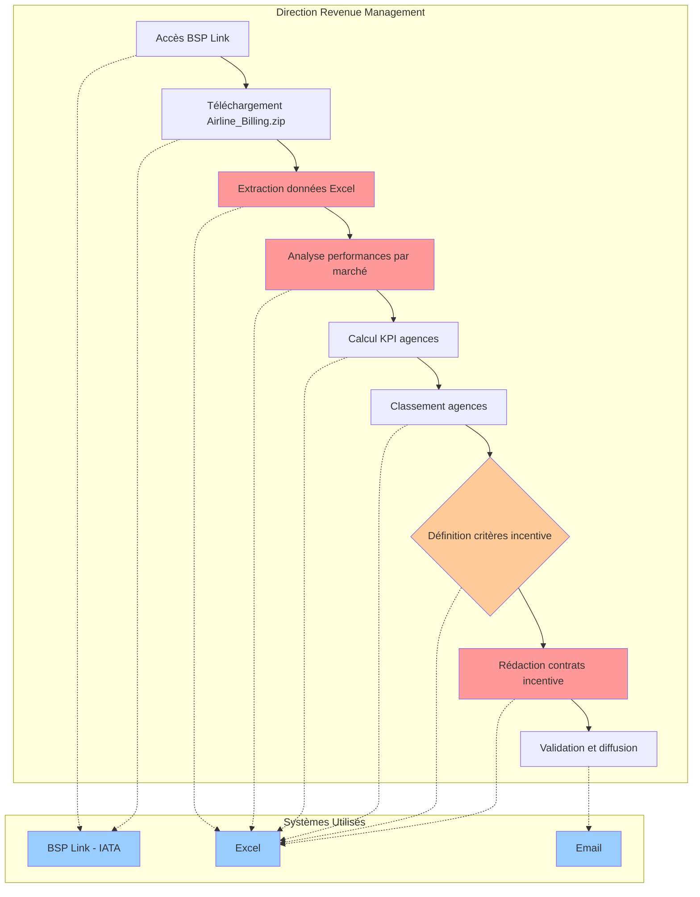

#### PROC-AA-DC-02 — Réduction des coûts de distribution (GDS)

- **Étapes** : 6 · **Statut diagramme** : ✍️ statique (étapes) · **Catégorie** : `COMMERCIAL` · **Statut process** : `DOCUMENTED`
- **Structures impactées** : DC, DVR

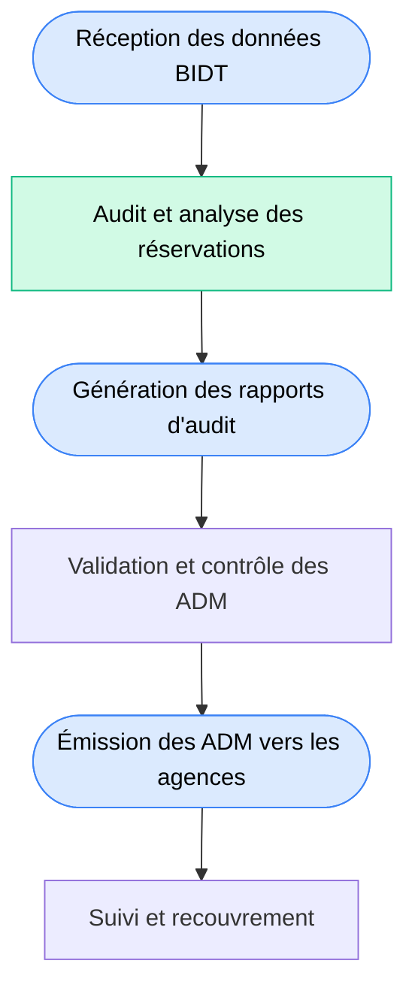

#### PROC-AA-DC-03 — Procédure de traitement des appels entrants

- **Étapes** : 12 · **Statut diagramme** : ✍️ statique (étapes) · **Catégorie** : `COMMERCIAL` · **Statut process** : `DOCUMENTED`
- **Structures impactées** : DC, DVR

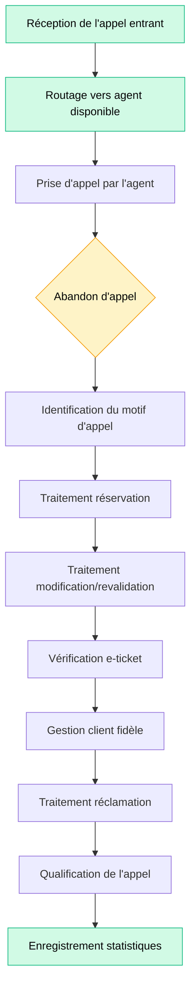

#### PROC-AA-DIVEX-02 — Programmation des enveloppes des vols charters(OMRA,HADJ,Sahraouis,OIM,ponctuels)ainsi que leur régulation

- **Étapes** : 19 · **Statut diagramme** : ✍️ statique (étapes) · **Catégorie** : `OPERATIONAL` · **Statut process** : `DOCUMENTED`
- **Structures impactées** : DC, DIVEX, DMRA, DOA, DVR

```mermaid
flowchart TD
    S1441(["Expression du besoin par SD Charters"])
    S1442["Étude de faisabilité technique et opérationnelle"]
    S1443["Validation disponibilité flotte par DMRA"]
    S1444["Validation faisabilité technique par DOA"]
    S1445["Élaboration de la proposition de programme"]
    S1446(["Transmission proposition à DVR"])
    S1457["Élaboration du devis chiffré par la DVR"]
    S1458(["Transmission du devis chiffré au client par la DVR"])
    S1459{"Acceptation / Refus du devis par le client"}
    S1447{"Validation par DVR"}
    S1448(["Diffusion de l'intention de programmation"])
    S1449["Demande des slots"]
    S1450["Demande autorisations aviation civile"]
    S1451["Demande autorisations de survol"]
    S1452[/"Attente et consolidation des accords"/]
    S1453["Lancement des vols charters"]
    S1454["Gestion des refus d'accords"]
    S1455["Transmission au système passagers"]
    S1456(["Diffusion finale des enveloppes"])
    S1441 --> S1442
    S1442 --> S1443
    S1443 --> S1444
    S1444 --> S1445
    S1445 --> S1446
    S1446 --> S1457
    S1457 --> S1458
    S1458 --> S1459
    S1459 --> S1447
    S1447 --> S1448
    S1448 --> S1449
    S1449 --> S1450
    S1450 --> S1451
    S1451 --> S1452
    S1452 --> S1453
    S1453 --> S1454
    S1454 --> S1455
    S1455 --> S1456
    style S1441 fill:#dbeafe,stroke:#3b82f6,color:#000
    style S1446 fill:#dbeafe,stroke:#3b82f6,color:#000
    style S1458 fill:#dbeafe,stroke:#3b82f6,color:#000
    style S1459 fill:#fef3c7,stroke:#f59e0b,color:#000
    style S1447 fill:#fef3c7,stroke:#f59e0b,color:#000
    style S1448 fill:#dbeafe,stroke:#3b82f6,color:#000
    style S1452 fill:#fee2e2,stroke:#ef4444,color:#000
    style S1456 fill:#dbeafe,stroke:#3b82f6,color:#000
```

#### PROC-AA-DIVEX-04 — Affrètement et fretement

- **Étapes** : 17 · **Statut diagramme** : 🤖 généré IA · **Catégorie** : `OPERATIONAL` · **Statut process** : `DOCUMENTED`
- **Structures impactées** : CCO, DAG, DAGP, DC, DG, DIVEX, DOA

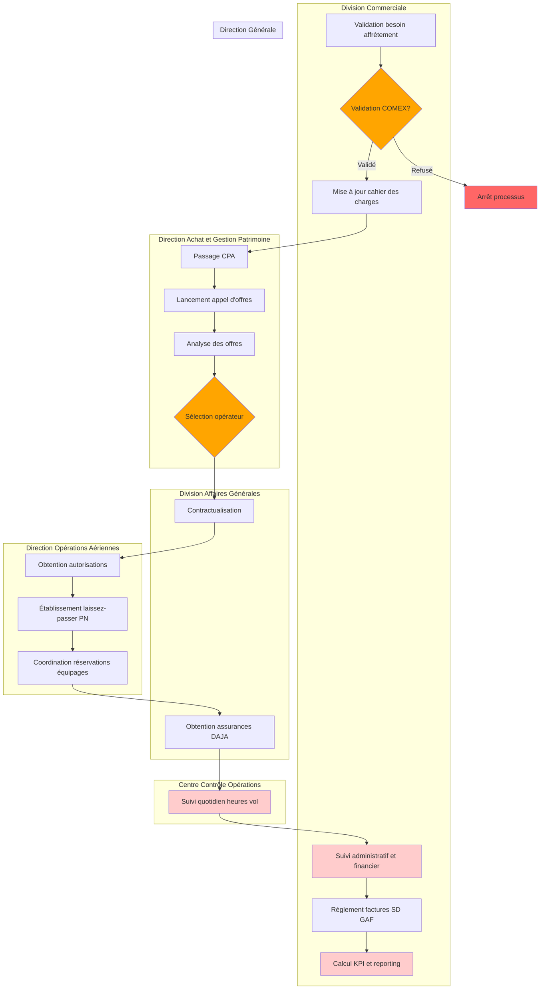

#### PROC-AA-DIVEX-11 — Gestion des codes compagnies (Carrier Code)

- **Étapes** : 9 · **Statut diagramme** : 🤖 généré IA · **Catégorie** : `OPERATIONAL` · **Statut process** : `DOCUMENTED`
- **Structures impactées** : DC, DIVEX, DOA, DSI

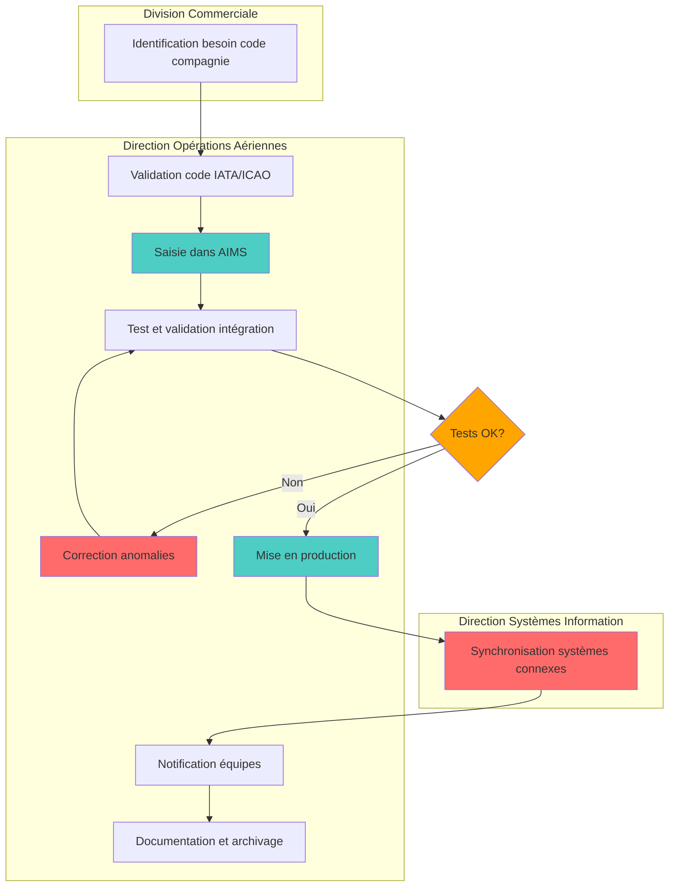

#### PROC-AA-DOS-05 — Datawarehouse Feeds

- **Étapes** : 5 · **Statut diagramme** : ✍️ statique (étapes) · **Catégorie** : `OPERATIONAL` · **Statut process** : `DOCUMENTED`
- **Structures impactées** : DOS, DRM, DSI

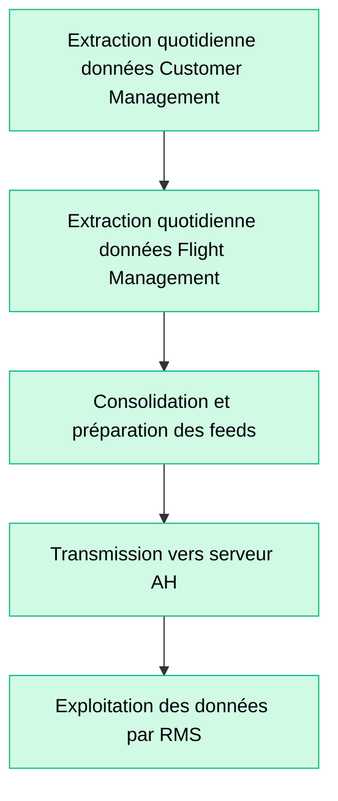

#### PROC-AA-DRM-01 — Affichage de nouvelles destinations sur l'IBE

- **Étapes** : 7 · **Statut diagramme** : 🤖 généré IA · **Catégorie** : `COMMERCIAL` · **Statut process** : `DRAFT`
- **Structures impactées** : DC, DRM

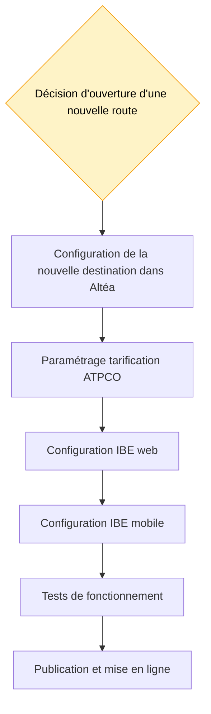

#### PROC-AA-DRM-02 — Filling de tarifs

- **Étapes** : 10 · **Statut diagramme** : 🤖 généré IA · **Catégorie** : `COMMERCIAL` · **Statut process** : `DRAFT`
- **Structures impactées** : DRM

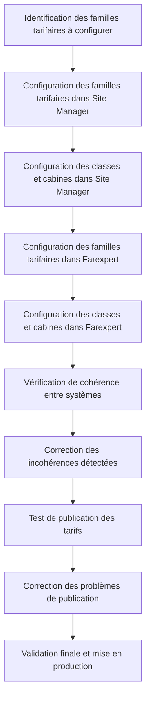

#### PROC-AA-DRM-03 — Configuration et mapping de nouvelles destinations

- **Étapes** : 9 · **Statut diagramme** : 🤖 généré IA · **Catégorie** : `COMMERCIAL` · **Statut process** : `DRAFT`
- **Structures impactées** : DC, DRM, DSI

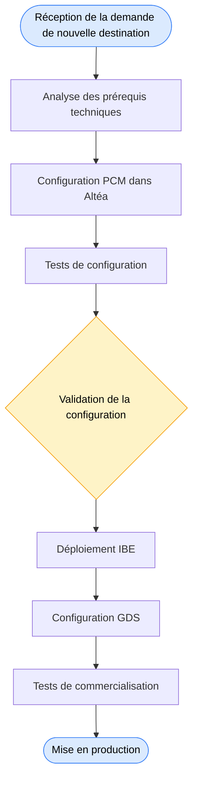

#### PROC-AA-DRM-04 — Publication et affichage sur le site et l'application mobile

- **Étapes** : 5 · **Statut diagramme** : 🤖 généré IA · **Catégorie** : `COMMERCIAL` · **Statut process** : `DRAFT`
- **Structures impactées** : DRM

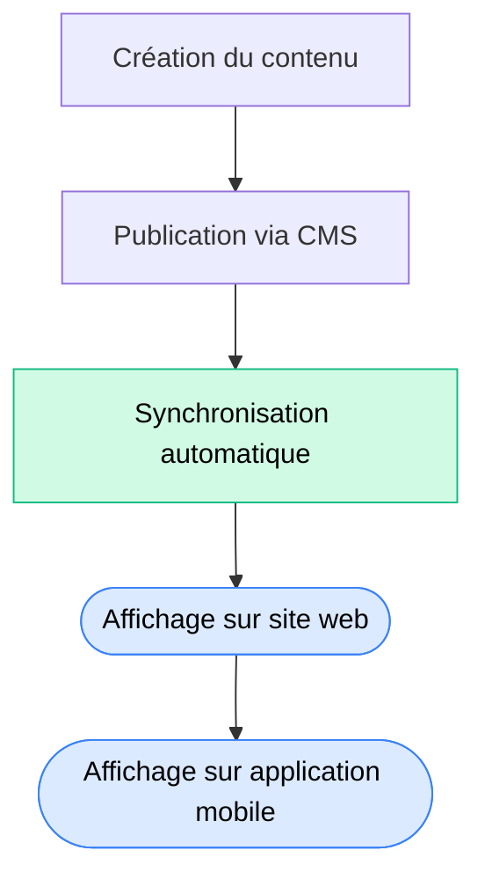

#### PROC-AA-DRM-05 — Configuration des codes promo / discounts

- **Étapes** : 8 · **Statut diagramme** : 🤖 généré IA · **Catégorie** : `COMMERCIAL` · **Statut process** : `DRAFT`
- **Structures impactées** : DC, DRM, DSI

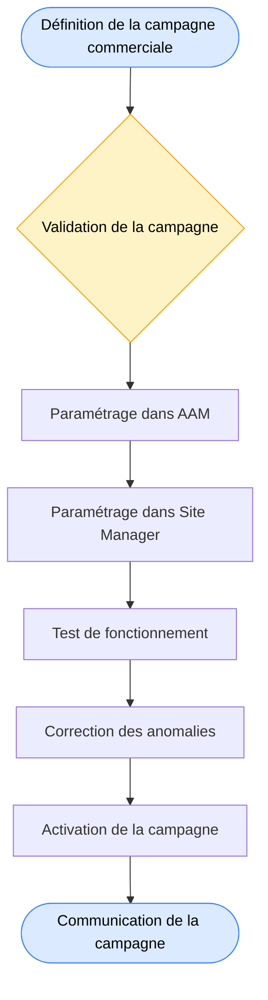

#### PROC-AA-DRM-06 — Comptabilité et rapprochement IBE

- **Étapes** : 9 · **Statut diagramme** : ✍️ statique (étapes) · **Catégorie** : `FINANCE` · **Statut process** : `DRAFT`
- **Structures impactées** : DFC, DRM

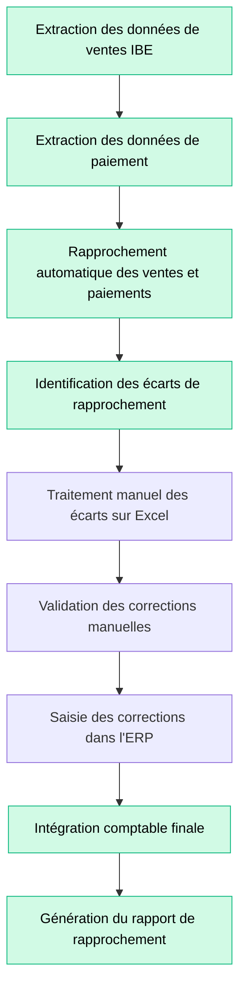

#### PROC-AA-DRM-07 — Suivi des anomalies de paiement

- **Étapes** : 12 · **Statut diagramme** : 🤖 généré IA · **Catégorie** : `FINANCE` · **Statut process** : `DRAFT`
- **Structures impactées** : DC, DRM

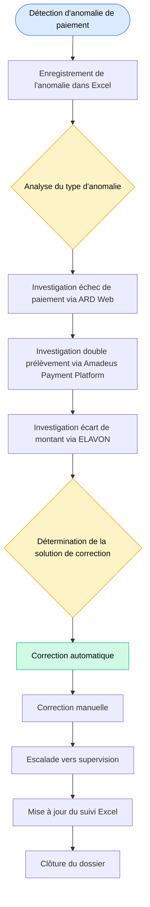

#### PROC-AA-DRM-08 — Traitement des chargebacks

- **Étapes** : 11 · **Statut diagramme** : 🤖 généré IA · **Catégorie** : `FINANCE` · **Statut process** : `DRAFT`
- **Structures impactées** : DRM

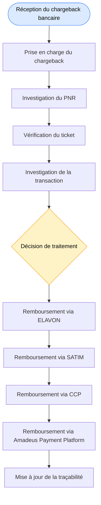

#### PROC-AA-DRM-09 — Traitement des demandes de remboursement

- **Étapes** : 11 · **Statut diagramme** : 🤖 généré IA · **Catégorie** : `FINANCE` · **Statut process** : `DRAFT`
- **Structures impactées** : DC, DFC, DRM, DSI

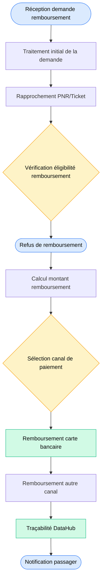

#### PROC-AA-DRM-10 — Etablissement des factures

- **Étapes** : 6 · **Statut diagramme** : ✍️ statique (étapes) · **Catégorie** : `FINANCE` · **Statut process** : `DRAFT`
- **Structures impactées** : DFC, DRM

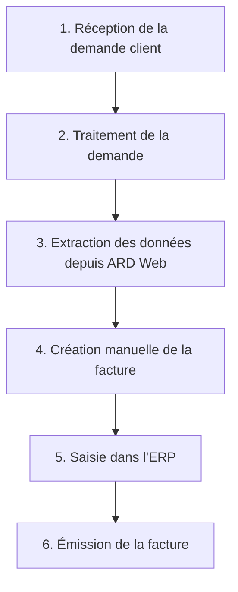

#### PROC-AA-DRM-11 — Analyse de performance du site web et de l'application mobile

- **Étapes** : 9 · **Statut diagramme** : 🤖 généré IA · **Catégorie** : `IT` · **Statut process** : `DRAFT`
- **Structures impactées** : DRM, DSI

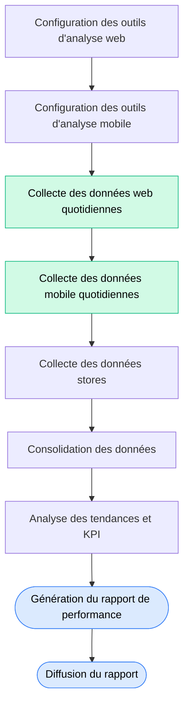

#### PROC-AA-DRM-12 — Suivi de l'état de santé des plateformes (monitoring)

- **Étapes** : 9 · **Statut diagramme** : 🤖 généré IA · **Catégorie** : `IT` · **Statut process** : `DRAFT`
- **Structures impactées** : DRM, DSI

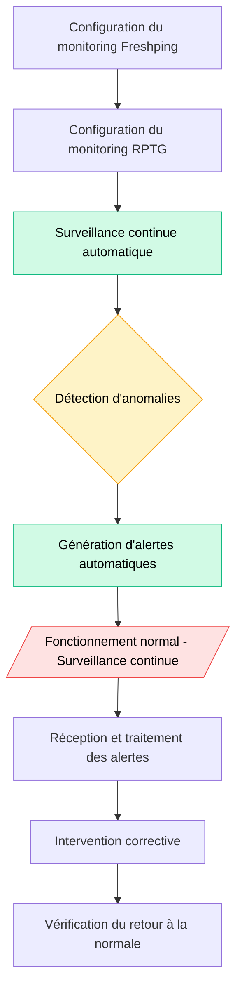

#### PROC-WT-001 — Gestion des irrégularités bagages (perte, retard, OHD)

- **Étapes** : 8 · **Statut diagramme** : ✍️ statique (étapes) · **Catégorie** : `OPERATIONAL` · **Statut process** : `VALIDATED`
- **Structures impactées** : DAG, DFC, DOS, DSI, DVR

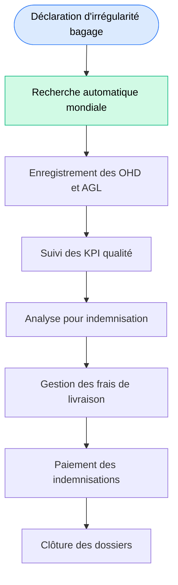

---

<!-- END_MERMAID_DIAGRAMS -->

## 7. Points de friction identifiés

### 7.1 Friction transverse n° 1 — TF-DC-01 Rapprochement Distribution ↔ Recettes � *(reformulée 24/05/2026)*

- **Process** : `PROC-AA-DC-01` (incentives) + audits ACCELYA-DIST + comptabilité IBE + chargebacks
- **Structures impactées** : DVR · DRM · SDRC · unités locales (33 BSP)
- **Systèmes concernés** : ACCELYA-DIST (Axelia — audit ADM), BSPLINK
- **État actuel précisé par la restitution 24/05/2026** :
  - ✅ **Rapprochement automatique via ACCELYA RAPID** (Revenue Accounting) pour les ventes directes ET indirectes — c'est le moteur principal, capture et détection d'anomalies sur inputs utilisateurs.
  - ⚠️ **Manuel sur Axelia** : les audits ADM liés au booking sont transmis par fichiers aux unités locales et vérifiés manuellement.
  - ⚠️ **Extraction Excel mensuelle** pour l'étude de performance par agence (~33 BSP, multiples agences par BSP) — toujours réalisée au niveau central, contraignante.
- **Impact** : la friction est réelle mais **moins large que l'estimation v1.0** : elle concerne le volet **audit/booking** et l'**étude de performance agences**, pas l'ensemble du rapprochement.
- **Solution Phase 2** : Lot 7 (alimentation automatique d'Axelia) + Lot 8 (datamart performance agences, suppression de l'extraction mensuelle manuelle).
- **KPI cible** : alimentation Axelia temps réel (vs réception fichiers manuels) + dashboard performance agences live.

### 7.2 Friction n° 2 — Process DRM financiers manuels sur Excel 🟠 *(reformulée 24/05/2026)*

- **Origine précisée 24/05/2026** : contrairement à l'estimation v1.0, **la programmation des vols et le suivi tarifaire ne sont PAS sur Excel** (systèmes dédiés + RMS Amadeus). De même les **charges back** sont gérées via une plateforme externe dédiée (~Merchant Connect).
- **Vraies frictions Excel restantes** :
  - **Rapprochement bancaire** : multi-sources, plusieurs fichiers Excel à consolider.
  - **Réconciliation et anomalies de paiement** : investigations croisées ARD Web / Amadeus Payment Platform / ELAVON, tableaux Excel personnels.
  - **Élaboration des devis charter** (cf. §7.8) — friction à part entière.
  - **Étude de performance des agences (33 BSP)** : extraction mensuelle Excel central, hautement contraignante.
- **Solution Phase 2** : automatisation ciblée par cas d'usage (Lots 7 + 8), pas d'«automatisation générale» mais des points précis.

### 7.3 Friction n° 3 — BAC mal positionné dans la cartographie initiale 🟠

- **Origine** : le key user actuel n'est pas l'interlocuteur pertinent (cf. §4.3.2).
- **Conséquence** : questionnaire BAC à retravailler en séparant **opérationnel** (BAC) et **financier** (SD Recettes Commerciales).
- **Solution court terme** : réaffectation key user + scission du questionnaire en deux instances.

### 7.4 Friction n° 4 — Limites fonctionnelles Axelia vs Zeus 🟠

- **Origine** : Axelia manque de filtres personnalisés et propose des exports moins riches que l'ancien outil Zeus (cf. §4.3.4).
- **Conséquence** : les utilisateurs DVR perdent en autonomie analytique.
- **Solution Phase 2** : compléter Axelia par un **dashboard interne** dans le datamart (Lot 8), avec analyses par canal / agence / tendance / part de marché et lien RAPID.

### 7.5 Friction n° 5 — Idoléance V2 non couvert par la cartographie initiale 🟠

- **Origine** : la version 2 d'Idoléance ajoute litige bagage (World Tracer) et FFP (ALMS) — la cartographie ne les modélise pas encore.
- **Solution** : mise à jour V1.1 du dossier + ajout des systèmes WorldTracer / ALMS dans la cartographie + ajout des flux entrants vers E-doléance.

### 7.6 Friction n° 6 — Accès Altea : pas de base directe, pas de gratuité 🔴

- **Origine** : Amadeus n'autorise pas l'accès direct à la base Altea ; les APIs nécessitent un Change Proposal (payant).
- **Conséquence** : l'architecture cible Phase 2 doit s'appuyer sur les **feeds quotidiens Amadeus** (PNR/Ticket/Payment) et éventuellement des APIs **ciblées** (cas par cas).
- **Solution Phase 2** : rédaction d'un **cahier des charges précis** des données ciblées + dossier Amadeus pour Change Proposal sur APIs prioritaires (Lot 5).

### 7.7 Friction n° 7 — Suivi paiement BSP Algérie reste manuel 🟠

- **Origine** : pour la plupart des marchés, BSP gère automatiquement le suivi des incidents de paiement ; en **Algérie**, le suivi reste manuel.
- **Solution** : workflow comptable automatisé Phase 2 (Lot 7) intégrant ELAVON / SATIM / CCP.

### 7.8 Friction n° 8 — Élaboration des devis charter sur Excel 🔴 *(ajoutée 24/05/2026)*

- **Origine** : le devis chiffré d'un vol charter est intégralement élaboré sur **Excel** par les Cadres Commerciaux DVR / Sous-directeur Charter.
- **Inputs manuels** : coût heure de vol (DPD), temps de vol (DOA), dispo appareil (DMRA via IMS), taxes (Altéa), destination, nb passagers, type appareil — saisis et réinjectés à chaque devis.
- **Process actuel** : majoration manuelle des coûts, calcul du temps de vol via formule Excel, double ou triple check par collègue / chef de département / sous-directeur.
- **Durée** : 10-15 min si toutes les données disponibles, **2 à 3 jours** sinon — pour les charters de dernière minute, des devis **estimatifs** sont produits sans retour DPD/DOA, avec moyenne réseau.
- **Volume** : croissance significative des vols charter ces dernières années, **impact financier majeur**, et donc impact des erreurs humaines important.
- **Constat** : tentative antérieure d'outillage à la SD Systèmes (Mme Chenane) n'avait pas abouti ; nouvelle demande transmise à l'ADSI, en priorité inscrite plus bas dans le backlog.
- **Solution Phase 2 — quick win identifié** : développement d'un mini-outil de cotation relié aux **APIs Amadeus** (taxes auto), à **IMS** (dispo appareil), et au référentiel coûts DPD. À étudier sous le Lot 8.
- **KPI cible** : devis élaboré en < 5 min, suppression des estimatifs sur urgence, suppression du double-check humain systématique.

### 7.9 Friction n° 9 — Mass Mailing ERP HADGE non étendu aux charters 🟠 *(ajoutée 24/05/2026)*

- **Origine** : une application **Mass Mailing ERP HADGE** existe depuis ~3 ans, permettant d'émettre les billets en **2-3 minutes** pour les opérations HADGE (vols full capacity). Elle n'est **pas étendue** aux vols charter alors qu'ils ont la même caractéristique (full capacity, liste passagers connue).
- **Conséquence** : l'émission des billets charter est aujourd'hui **manuelle** — erreurs humaines, perte de temps opérationnelle.
- **Solution court terme** : extension de l'application existante aux charters (pas de développement neuf, juste un déploiement / paramétrage).
- **KPI cible** : émission billet charter < 5 min vs manuel actuel.

---

## 8. Recommandations

### 8.1 Court terme — quick wins (avant la Phase 2)

| # | Action | Effort | Bénéfice |
|---|---|:---:|---|
| QW-1 | **Scinder le questionnaire BAC** en opérationnel (Amadeus Reporting) + financier (SD Recettes Commerciales) | 2 j/h | Couverture correcte des deux périmètres |
| QW-2 | **Réaffecter le key user BAC** à un interlocuteur reporting opérationnel | 1 j/h | Données fiables |
| QW-3 | **Actualiser le questionnaire E-Doléance** pour intégrer la V2 (litige bagage + FFP) | 3 j/h | Cartographie alignée avec le produit livré |
| QW-4 | **Confirmer et lister** les ~150 contrats Interline + les 2 CodeShare actifs (SD Coopération) | 5 j/h | Référentiel partenaires fiable |
| QW-5 | **Documenter** les ~15 systèmes hypothèses (Site Manager, PCM, Farexpert, AAM, ELAVON, SATIM, CCP, DataHub, etc.) et les **intégrer** à la cartographie | 8 j/h | Cartographie complète DRM |
| QW-6 | **Fournir un exemple anonymisé** du calcul des incentives (Mahanemi / SAAD Nassima) | 2 j/h | Validation Process DC-01 |
| QW-7 | **Récupérer les fichiers RAPID** demandés par SAAD Nassima | 2 j/h | Levée action en suspens |
| QW-8 | **Étendre le Mass Mailing ERP HADGE aux vols charter** (application déjà développée, juste à déployer) | 5-10 j/h | Émission billets charter 2-3 min vs manuel — *(restitution 24/05/2026)* |
| QW-9 | **Réaffecter le key user World Tracer** à la division Exploitation (et non DC) | 1 j/h | Cartographie alignée responsabilités réelles |
| QW-10 | **Réorganiser les étapes du process DIVEX-02** après l'étape 6 (devis chiffré + acceptation client à insérer) | 2 j/h | Process reflète la réalité opérationnelle — *(action faite côté cartographie, en attente validation)* |

### 8.2 Moyen terme — Phase 2 (lots concernés)

| # | Recommandation | Lot Phase 2 | Bénéfice |
|---|---|---|---|
| R-1 | **Hub d'extraction Altea** (PNR / Ticket / Payment) via feeds Amadeus | Lot 5 + Lot 6 | Données commerciales centralisées, base du datamart |
| R-2 | **Workflow comptable automatisé** : rapprochement Axelia / BSP ↔ recettes (suppression Excel) | Lot 7 | Suppression du rapprochement manuel, traçabilité complète |
| R-3 | **Refonte chaîne paiement** : intégration ELAVON / SATIM / CCP / Amadeus Payment Platform pour chargebacks et remboursements | Lot 7 | Délais de traitement divisés par 3 |
| R-4 | **MDM Tarif & Distribution** : ATPCO/OAG maîtres pour la tarification, programme | Lot 12 | Référentiel unique propagé à Altea, IBE, GDS |
| R-5 | **Dashboard commercial unifié** : analyses par canal, agence, tendance, prévision, part de marché + lien RAPID | Lot 8 | Comble le gap Zeus → Axelia |
| R-6 | **Vision client 360** : rapprochement PNR / téléphone / e-doléance / agence | Lot 8 | Service client amélioré |
| R-7 | **Workflow validation électronique** des contrats incentive (DC-01) | Lot 8 | Suppression Excel, traçabilité |
| R-8 | **Mini-outil de cotation charter** relié à APIs Amadeus (taxes) + IMS (dispo appareil) + référentiel coûts DPD | Lot 8 | Devis < 5 min vs 2-3 j en estimatif — *(restitution 24/05/2026)* |

### 8.3 Long terme — Phase 3 et au-delà

- Évaluer la souscription à des **APIs Amadeus complémentaires** via Change Proposal sur des cas d'usage à fort ROI (segmentation client, personnalisation IBE, scoring fraude).
- Étudier un **portail self-service d'extraction** Altea pour les utilisateurs DRM / DVR.
- Intégrer le **suivi monitoring plateformes** (Freshping / RPTG) au socle d'observabilité Phase 2.
- Évaluer la **mutualisation** des accès SATIM / CCP / ELAVON dans une **plateforme paiement Air Algérie** unifiée (vision long terme DFC).

---

## 9. Apports de l'ETL et du MDM à terme

### 9.1 Position de la DC dans la cible MDM

| Référentiel maître | Système maître | Systèmes consommateurs |
|---|---|---|
| **Tarification publiée** | **ATPCO** | ALTEA, SITEWEB, BAC, ACCELYA-DIST |
| **Programme de vol** | **AIMS** (master) / **OAG** (diffusion) | ALTEA, BAC, partenaires industrie |
| **Client / PNR** | **ALTEA** (PSS Amadeus) | VOCALCOM, SITEWEB, EDOLEANCE, BAC |
| **Distribution agences** | **BSPLINK** (IATA) | ACCELYA, DATAWINGS, comptabilité |
| **Catalogue produits / Promotions** | **PCM** + **AAM** (à confirmer) | SITEWEB, mobile, Call Center |

### 9.2 Flux apportés / industrialisés par l'ETL

| Flux ETL | Source | Cible | Fréquence | Statut cible |
|---|---|---|---|---|
| **Feed PNR quotidien** | ALTEA (Amadeus) | Datamart Alpha | Quotidien | À construire (Lot 5) |
| **Feed Ticket quotidien** | ALTEA (Amadeus) | Datamart + ERP-AH | Quotidien | À construire (Lot 5) |
| **Feed Payment quotidien** | ALTEA (Amadeus) | ERP-AH + Datamart | Quotidien | À construire (Lot 5 + 7) |
| **Rapprochement BSP / Axelia / Recettes** | BSPLINK + ACCELYA-DIST | ERP-AH | Quotidien | À construire (Lot 7) |
| **Chargebacks consolidés** | ELAVON + SATIM + CCP + Amadeus Pay | ERP-AH + EDOLEANCE | Quotidien | À construire (Lot 7) |
| **KPI commerciaux** | ALTEA, BSPLINK, SITEWEB, BAC | Datamart | Quotidien | À construire (Lot 6 + 8) |

### 9.3 Bénéfices attendus pour la DC

- **Suppression définitive** du rapprochement manuel ventes ↔ recettes.
- **Vision unifiée** des performances commerciales par canal (web, agence, call center, GDS).
- **Réduction du délai** de traitement des chargebacks (de J+15 à J+1 visé).
- **Visibilité temps réel** sur la disponibilité IBE / Call Center.
- **Référentiel unique** tarif & programme propagé à tous les canaux.
- **Capacité d'analyses prédictives** (saisonnalité, churn, segmentation).
- **Levée de la dépendance Excel** sur les process structurants DRM.

### 9.4 Ce qui restera côté éditeurs

- **Altea (Amadeus)** : intégralité du métier PSS (inventory, réservation, ticketing, DCS, RMS). L'ETL extrait, ne se substitue pas.
- **ATPCO** : tarification publiée — référentiel mondial.
- **OAG** : programme diffusé — référentiel industrie.
- **BSP Link** : compensation IATA — point d'entrée unique pour les agences accréditées.
- **Modules paiement** (ELAVON, SATIM, CCP, Amadeus Pay) : exécution monétique — Air Algérie reste consommatrice.

---

## 10. Annexes

### A. Référents DC mobilisés Phase 1

| Nom | Rôle | Système / Périmètre | Statut |
|---|---|---|---|
| **BELDJERDI Zakaria** | Key user — Site WEB IBE | SITEWEB + canevas DRM (12 process) | Questionnaire complété + canevas 19/05/2026 |
| **LAIDANI Zakaria** | Key user — Tarification | ATPCO | Questionnaire complété |
| **SAFAR ZITOUN Naim** | Key user — Programme | OAG / INNOVATA | Questionnaire complété |
| **HASSISSENE Chemseddine** | Key user — BAC (à réaffecter) | BAC (Amadeus) | Questionnaire complété — réaffectation requise |
| **SAAD Nasima / Nassima** | Key user — Distribution agences | ACCELYA Distribution + BSP Link | Questionnaire complété |
| **BOUCHIK Mounir** | Key user — Call Center | Hermès Call Center (VocalCom) | Questionnaire complété |
| **AKKACHA Mohamed Amine** | Key user — E-Doléance | E-Doléance | À démarrer (V2) |
| **Mme Bouneb, Mme Saadal** | Participantes entretien DVR | DVR (transverse) | Entretien 29/04/2026 |
| **Leila Chenane** | Animatrice entretien DRM | DRM (transverse) | Entretien 22/04/2026 |
| **nassim nassim, Benkerit** | Participants entretien DRM | DSI / DRM | Entretien 22/04/2026 |
| **Mahanemi** | Sous-direction DRM (incentives) | Contrats incentive | Entretien 29/04/2026 |
| **SD Coopération** | Contrats SPA / CodeShare / Interline | Périmètre coopération | Entretien 29/04/2026 |

### B. Inventaire détaillé des processus DC

| Code | Libellé | Étapes | Catégorie | Structures impliquées |
|---|---|:---:|---|---|
| `PROC-AA-DC-01` | Etablissement de contrats incentive | 9 | Métier | DC, DVR |
| `PROC-AA-DC-02` | Réduction des coûts de distribution (GDS) | 6 | Métier | DC, DVR |
| `PROC-AA-DC-03` | Procédure de traitement des appels entrants | 12 | Métier | DC, DVR |
| `PROC-AA-DIVEX-02` | Programmation enveloppes vols charters | 16 | Opérationnel | DC, DOA, DMRA, DIVEX, DVR |
| `PROC-AA-DIVEX-04` | Affrètement et frêtement | 17 | Opérationnel | DC, DOA, DAGP, DIVEX, DG, DAG, CCO |
| `PROC-AA-DIVEX-11` | Gestion des codes compagnies (Carrier Code) | 9 | Support | DSI, DC, DOA, DIVEX |
| `PROC-AA-DOS-05` | Datawarehouse Feeds | 5 | Support | DSI, DOS, DRM |
| `PROC-WT-001` | Gestion irrégularités bagages | 8 | Métier | DSI, DOS, DFC, DAG, DVR |

### C. Inventaire des flux DC

| # | Flux | Sens | Fréq. | Auto | Critique |
|---|---|---|---|:---:|:---:|
| F-2 | Programme de Vol OAG | AIMS → OAG | Quotidien | ✅ | — |
| F-12 | Compensation BSP | BSPLINK → ACCELYA | Périodique | ✅ | 🔴 |
| F-15 | Tarifs ATPCO | ATPCO → ALTEA | Quotidien | ✅ | 🔴 |
| F-18 | Disponibilités IBE | ALTEA → SITEWEB | Temps réel | ✅ | 🔴 |
| F-19 | Réservations Web | SITEWEB → ALTEA | Temps réel | ✅ | 🔴 |
| F-20 | Données PNR Call Center | ALTEA → VOCALCOM | Temps réel | ✅ | 🔴 |
| F-21 | Modifications PNR | VOCALCOM → ALTEA | Temps réel | ✅ | 🔴 |
| F-22 | Ventes Agences | ALTEA → BSPLINK | Quotidien | ✅ | 🔴 |
| F-23 | Données Distribution | ALTEA → ACCELYA-DIST | Quotidien | ✅ | — |
| F-24 | Contrôle Distribution | ACCELYA-DIST → ACCELYA | Périodique | ✅ | — |
| F-34 | Ventes BSP France | BSPLINK → DATAWINGS | Périodique | ✅ | — |
| F-44 | Bookings BAC | ALTEA → BAC | Quotidien | ✅ | — |
| F-49 | Réclamations Passagers | ALTEA → EDOLEANCE | Périodique | ✅ | — |
| F-58 | Programme OAG Retour | OAG → ALTEA | Quotidien | ✅ | — |

### D. Action items issus des entretiens

#### D.1 Entretien DRM — 22/04/2026

| Owner | Action |
|---|---|
| Mohamedamine Karki | Produire document complet pour Amadeus couvrant PSS, Altea, IMS |
| Mohamedamine Karki | Rédiger la réaffectation des questions IMS dans l'outil |
| Mohamedamine Karki | Joindre exemples de fichiers PNR aux participants |
| Mohamedamine Karki | Réaffecter les flux aux modules techniques Altea (DCS, RMS, Inventory…) |
| ALi KARKI | Rédiger document récap pour validation Amadeus avant réunion |
| ALi KARKI | Programmer nouvelle réunion pour parcourir les réponses manquantes |
| ALi KARKI | Préparer et présenter le dossier au comité exécutif à partir du 03/05 |
| ALi KARKI | Retravailler le mapping système, intégrer les process transmis |
| Leila Chenane | Transmettre process / systèmes / outputs KPI via son directeur |
| Équipe DRM | Renvoyer toutes les réponses aux questions de son périmètre |
| Équipe DRM | Remplir le dernier questionnaire manquant |
| nassim nassim | Demander disponibilité Amadeus pour reprogrammer la réunion |
| nassim nassim | Lister les données à cibler pour la cartographie DRM |

#### D.2 Entretien DVR — 29/04/2026

| Owner | Action |
|---|---|
| Mohamed Amin | Noter précisions Idoléance ↔ DCS / ARDWeb et mettre à jour la cartographie |
| Mohamed Amin | Ajouter Axelia, BSP Link, VocalCom, BAC dans la cartographie et préciser dépendance DVR |
| Mohamedamine Karki | Renvoyer fichiers et documents process aux participants |
| Mohamedamine Karki | Vérifier la liste des ~150 contrats Interline + 2 CodeShare |
| Mohamedamine Karki | Réaffecter le key user du système BAC |
| Mohamedamine Karki | Refaire les questionnaires en séparant opérationnel (BAC) / financier |
| Tous participants | Reporter informations dans les fichiers Excel fournis (canevas process) |
| SAAD Nassima | Envoyer fichiers RAPID demandés ou indiquer interlocuteur |
| SAAD Nassima | Actualiser le questionnaire et l'envoyer aux parties concernées |
| ALi KARKI | Formaliser les références utilisées pour le rapprochement (PNR, pays, n° billet) |
| Mahanemi | Fournir exemple anonymisé du calcul des incentives |
| DSI | Fournir les réponses manquantes aux questions transmises par Hassissene |
| Mohamed Demi | Examiner et résoudre l'incident technique du système signalé |

### E. Documents de référence

- **Manuel des Processus Air Algérie** (DQSA, juin 2021) — référentiel d'arbitrage.
- **Rapport de Diagnostic global** — `Lot_1_Diagnostic/01_Rapport_Diagnostic.md`.
- **Cartographie SI** — `Lot_1_Diagnostic/02_Cartographie_SI.md`.
- **Rapport d'analyse des frictions** — `Lot_2_Analyse_Frictions/01_Rapport_Frictions.md`.
- **Recommandations consolidées** — `Lot_2_Analyse_Frictions/02_Recommandations.md`.
- **Transcript Entretien DRM** — `Etat actuel/SITA - AMADEUS/Cartographie DRM- Air Algérie Transcript.txt` (22/04/2026).
- **Résumé Entretien DRM** — `Cartographie DRM- Air Algérie Résumé.txt` (22/04/2026).
- **Transcript & Summary Entretien DVR** — fichiers transmis par M. KARKI (29/04/2026).
- **Canevas Process Key-Users** — `Copie de CANEVAS_PROCESS_KEY_USERS (003).xlsx` (BELDJERDI, 19/05/2026).

### F. Validation et suite

- **Validation key-users (7 sur 8)** : ✅ Questionnaires soumis.
- **Validation key-user E-Doléance V2** : 🟠 À démarrer.
- **Validation hiérarchique DC / DRM / DVR** : 🟠 À effectuer via le workflow multi-structure de l'application `cartographie_si` (route `/process/<code>/valider/<token>/`).
- **Échéance proposée pour retour direction** : 1 semaine après diffusion du présent dossier.
- **Présentation au comité exécutif** : prévue à partir du 03/05/2026 (action ALi KARKI).

---

## Journal des révisions

| Version | Date | Auteur | Description |
|---|---|---|---|
| 1.0 | 23 mai 2026 | Alpha — M. KARKI | Création initiale du dossier de restitution DC, basée sur les transcripts des entretiens DRM (22/04/2026) et DVR (29/04/2026), le canevas Process Key-Users BELDJERDI (19/05/2026) et l'extraction `_data_dc.json` de la cartographie locale (8 systèmes, 14 flux, 8 process, 8 key users, 72/72 questions répondues). |
| 1.3 | 24 mai 2026 | Alpha — M. KARKI | **Synchronisation diagrammes Mermaid avec la cartographie locale** (§6.5) : insertion d'une nouvelle section §6.5 contenant les diagrammes Mermaid **exacts** des **20 process** liés à la Division Commerciale (filtre dynamique `structures ∈ {DC, DVR, DRM}` — couvre DC, DRM-01 à DRM-12, DIVEX-02/04/11, DOS-05, WT-001), encadrée par les marqueurs `<!-- BEGIN_MERMAID_DIAGRAMS -->` / `<!-- END_MERMAID_DIAGRAMS -->`. Section régénérée automatiquement par `cartographie_si/scripts/sync_dossier_dc_mermaid.py` (lecture directe du champ `workflow_mermaid` du modèle `Process`). |
| 1.2 | 24 mai 2026 | Alpha — M. KARKI | **Précision RAPID dans la chaîne de facturation** (§6.4) : explicitation du rôle ACCELYA RAPID (Revenue Accounting) en amont du process `PROC-AA-DRM-10` Établissement des factures. ARD Web restitue les données issues de RAPID avant extraction manuelle pour facturation. Process enrichi en base (context, recommendations, étape 3) et système ACCELYA lié à l'étape 3. Répond au constat de la séance « le rapide n'est nulle part dans ce processus-là, on doit faire une revue complète de rapide ». |
| 1.1 | 24 mai 2026 | Alpha — M. KARKI | **Révision post-restitution DC du 24/05/2026** (Leila Chenane, nihad bounab, nassim nassim, Fiala, Manef Hadfi). Principales corrections : (1) ajout des systèmes **ALTEA** et **ACCELYA RAPID** dans la liste des systèmes DC (§4.1, 10 systèmes vs 8) ; (2) reformulation du **Constat n°2** — rapprochement automatisé via RAPID, manuel uniquement sur Axelia ; (3) reformulation du **Constat n°9** — Excel limité aux process financiers manuels (rapprochement bancaire, anomalies paiement, devis charter) ; (4) périmètre fonctionnel élargi (agences ATO/CTO, inventaire) ; (5) ajout §4.3.8 listant les 9 corrections majorées ; (6) **refonte des étapes 7–19 du process PROC-AA-DIVEX-02** (§6.2.4) avec insertion du devis chiffré, transmission au client, acceptation/refus ; (7) reformulation friction §7.1 (RAPID vs Axelia) et §7.2 (process Excel précisés) ; (8) ajout frictions §7.8 (devis charter Excel) et §7.9 (Mass Mailing ERP HADGE non étendu) ; (9) ajout des quick wins QW-8 (Mass Mailing), QW-9 (key user World Tracer), QW-10 (refonte DIVEX-02) ; (10) ajout recommandation R-8 (outil cotation charter). |
